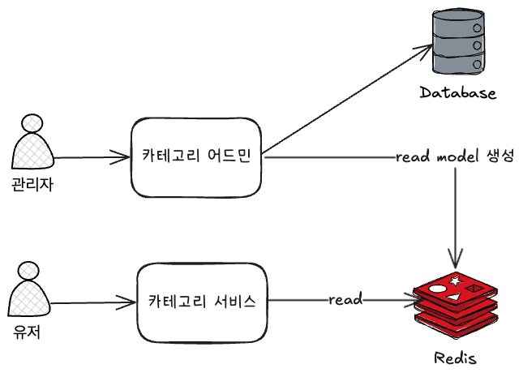

# 무신사 과제
온라인 쇼핑몰의 상품 카테고리를 구현하세요.

## 사전 요구사항

### 필수 설치 항목
* Java SDK 17 이상
* Kotlin 1.9 이상
* Docker 

## 애플리케이션 실행 방법

### 로컬 개발 환경 설정
#### docker-compose 실행
```shell
docker compose up -d
```
#### 어드민 실행
```shell
./gradlew :category-inbound:category-admin:bootRun --args='--spring.profiles.active=local --logging.level.root=DEBUG' 
```
#### 애플리케이션 실행
```shell
./gradlew :category-inbound:category-service:bootRun --args='--spring.profiles.active=local --logging.level.root=DEBUG' 
```


### 요구사항
* 카테고리 등록/수정/삭제 API
  * 카테고리를 등록/수정/삭제 할 수 있어야 합니다. 
* 카테고리 조회 API
  * 카테고리 조회 시 자기 자신을 포함해 하위 카테고리 조회가 가능해야 합니다.
  * 카테고리를 지정하지 않을 시, 전체 카테고리를 반환해야 합니다.
  * 카테고리는 트리 구조로 반환해야 합니다.

### 비기능 요구사항
* 트리 구조가 복잡해도 실시간 조회가 가능해야 한다
* 일반적인 확장성, 가용성 및 안정성 요구사항

### API Specification
* 서비스 API: http://localhost:8080/swagger-ui/index.html
* 어드민 API: http://localhost:9090/swagger-ui/index.html

--- 
## Architecture Overview
### 모듈 구조
hexagonal 아키텍처를 기반으로 한 모듈 구조입니다.

| 역할                | 설명                                |
|-------------------|-----------------------------------|
| category-inbound  | category 관련 application 단위들의 모듈   |
| category-core     | category 관련 usecase, domain 관련 모듈 |
| category-outbound | 도메인 외부 secondary adpater 단위들의 모듈  |

### 애플리케이션 컴포넌트
* 카테고리 서비스
  * 실제 Online 상에서 사용되는 카테고리 서비스
  * 카테고리 조회를 요청한다
* 카테고리 어드민
  * 카테고리 등록/수정/삭제를 요청한다


### TO-BE 아키텍처


| 역할              | 설명                            |
|-------------------|-------------------------------|
| 카테고리 어드민   | 카테고리 등록/수정/삭제, Read model 생성  |
| 카테고리 서비스   | 카테고리 조회, Read Model 조회 |
